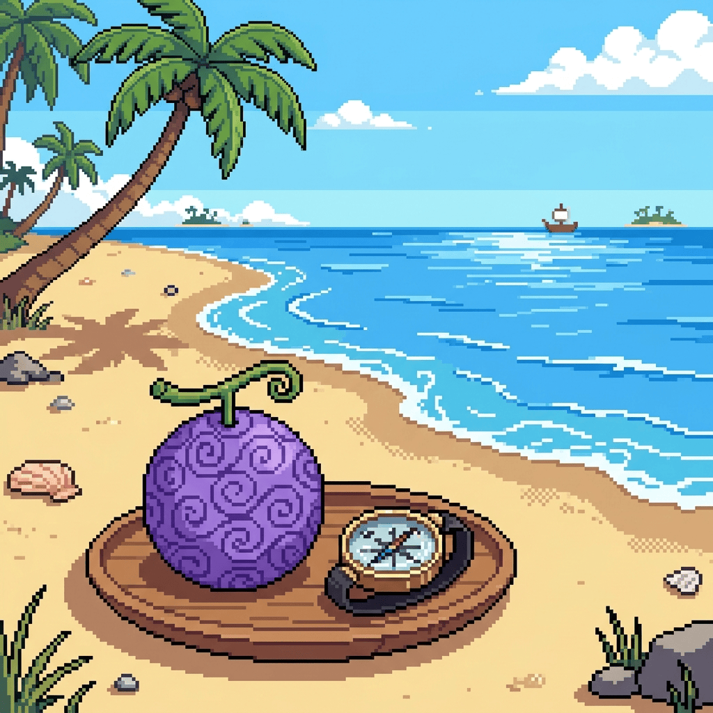

<div align="center">



# LogPose: Wither Fruits

**A One Piece–inspired Devil Fruit system for Minecraft.**

Eat a fruit. Gain a power. Never learn to swim again.


</div>

---

## Table of Contents

- [About](#about)
- [Features](#features)
- [The Fruits](#the-fruits)
- [Controls](#controls)
- [How Devil Fruits Work](#how-devil-fruits-work)
- [Finding a Fruit](#finding-a-fruit)
- [Installation](#installation)
- [Supported Versions & Loaders](#supported-versions--loaders)
- [Building from Source](#building-from-source)
- [Project Structure](#project-structure)
- [Contributing](#contributing)
- [Disclaimer](#disclaimer)
- [License](#license)
- [Acknowledgments](#acknowledgments)

---

## About

**LogPose: Wither Fruits** adds mysterious, wither-tainted fruits to Minecraft, each one granting the eater a unique supernatural power in the spirit of *One Piece*'s Devil Fruits.

Every fruit belongs to one of three classic archetypes — **Paramecia**, **Zoan**, or **Logia** — and comes with real trade-offs: the moment you swallow one, the sea itself turns against you. Powers persist across sessions, are fully synced between client and server, and are balanced through attribute modifiers, status effects, and cooldown-gated abilities rather than raw stat bloat.

This repository hosts one build of the mod for a specific Minecraft version and mod loader. The project is developed with future portability in mind — see [Supported Versions & Loaders](#supported-versions--loaders) for what's available and what's planned.

## Features

- 🍈 **Three Devil Fruit archetypes** — Paramecia (passive body transformation), Zoan (shapeshifting with Base/Hybrid/Full forms), and Logia (elemental immunity plus active attacks).
- ⚔️ **Active abilities** with independent and shared cooldowns for offense-oriented fruits.
- 🌊 **The classic curse** — once you carry a fruit's power, you lose the ability to swim, just like in the source material.
- 💀 **One fruit at a time** — eating a second fruit while empowered is instantly fatal, stripping your current power in the process.
- 💾 **Persistent state** — your fruit, its buffs, and your transformation state survive relogs and server restarts.
- 🗺️ **Natural loot integration** — fruits can be found in buried treasure and shipwreck treasure chests.
- 🔌 **Full client/server sync** — transformations, swim-lock, and ability triggers are networked cleanly with no client-side desync.

## The Fruits

| Fruit | Type | Rarity | Power |
|---|---|---|---|
| **Gum-Gum Fruit** | Paramecia | Uncommon | Turns your body to rubber: immune to fall, explosion, and lightning damage, a permanent Jump Boost, and stretched-out block/entity interaction range. |
| **Cat-Cat Fruit, Model: Leopard** | Zoan | Rare | Shapeshift into a leopard. **Full form** boosts speed, jump height, attack, fall resistance, and armor at the cost of block-breaking speed and size. **Hybrid form** trades mobility for raw combat power — extra health, armor, and attack damage. |
| **Flame-Flame Fruit** | Logia | Epic | Become fire itself: immunity to fire, explosions, projectiles, and lightning, plus permanent Fire Resistance. Launch small fireballs for quick pressure, or a devastating large fireball on a longer cooldown. |

More fruits are planned for future updates.

## Controls

| Key (default) | Action |
|---|---|
| `R` | Ability 1 — Logia: primary attack · Zoan: toggle Full transformation |
| `G` | Ability 2 — Logia: secondary attack · Zoan: toggle Hybrid transformation |

Both keybinds are fully rebindable from Minecraft's **Controls** menu.

## How Devil Fruits Work

- You can carry the power of only **one** fruit at a time.
- Eating a fruit while already empowered is **fatal** — it deals lethal Wither damage and removes your current power, mirroring the source material's rule that eating a second Devil Fruit kills you.
- The instant you gain a power, you **lose the ability to swim**. Stepping into deep water leaves you helpless until you're back on solid ground.
- Your power, active cooldowns, and transformation state are saved per-player and restored automatically, even after logging out or the server restarting.

## Finding a Fruit

Wither Fruits are not craftable — they're a rare find in the world's loot:

| Loot Source | Drop Chance |
|---|---|
| Buried Treasure Chest | 25% |
| Shipwreck Treasure Chest | 10% |

## Installation

1. Install [Fabric Loader](https://fabricmc.net/use/) for the Minecraft version you're playing.
2. Download the matching release of **LogPose: Wither Fruits** from this repository's [Releases](../../releases) page (or Modrinth/CurseForge, if published there).
3. Download [**Fabric API**](https://modrinth.com/mod/fabric-api) and [**Fabric Language Kotlin**](https://modrinth.com/mod/fabric-language-kotlin) for the same Minecraft version — both are required dependencies.
4. Drop all three `.jar` files into your `.minecraft/mods` folder.
5. Launch the game with the Fabric profile selected.

> **Requirements:** Java 21+, Fabric Loader, Fabric API, Fabric Language Kotlin.

## Supported Versions & Loaders

This repository targets a single Minecraft version and mod loader combination, listed below. The mod is developed with future versions and additional mod loaders in mind — check the badges at the top of this README or the Releases page for what this particular repository currently ships.

| Minecraft Version | Mod Loader | Status |
|---|---|---|
| 1.21.1 | Fabric | ✅ Available |
| Future versions | NeoForge | 🕒 Planned |

Support for new Minecraft versions and mod loaders will be published as separate releases, branches, or repositories as they become available.

## Building from Source

```bash
git clone https://github.com/GazizVR/logpose-wither-fruits.git
cd logpose-wither-fruits
./gradlew build
```

The compiled mod jar will be output to `build/libs/`.

To launch a development client with the mod loaded:

```bash
./gradlew runClient
```

## Project Structure

```
src/
├── main/               # Shared logic (runs on both client and server)
│   ├── kotlin/         # Fruits, abilities, buffs/debuffs, networking, persistence
│   └── resources/      # fabric.mod.json, mixins config, textures, models
└── client/             # Client-only code
    ├── kotlin/         # Keybinds, rendering mixins, client-side networking
    └── resources/      # Client mixins config
```

## Contributing

Contributions are welcome! If you'd like to add a new fruit, fix a bug, or improve balance:

1. Fork the repository and create a feature branch.
2. Make your changes, following the existing code style.
3. Open a pull request describing what changed and why.

Bug reports and feature suggestions are just as welcome — please open an [issue](../../issues).

## Disclaimer

**LogPose: Wither Fruits** is an unofficial, non-commercial fan project inspired by the Devil Fruit concept from Eiichiro Oda's *One Piece*. It is not affiliated with, endorsed by, or sponsored by Oda, Shueisha, Toei Animation, or any other rights holders. All references are made for creative/fan purposes only.

Minecraft is a trademark of Mojang Studios / Microsoft. This is an independent, unofficial mod not affiliated with Mojang or Microsoft.

## License

This project is licensed under the **MIT License** — see [LICENSE](LICENSE) for details.

## Acknowledgments

- [Fabric](https://fabricmc.net/) — mod loader and toolchain
- [Fabric API](https://github.com/FabricMC/fabric) — core hooks and events
- [Fabric Language Kotlin](https://github.com/FabricMC/fabric-language-kotlin) — Kotlin support for Fabric
- [Yarn Mappings](https://github.com/FabricMC/yarn) — Minecraft deobfuscation mappings
- Eiichiro Oda's *One Piece* — creative inspiration for the Devil Fruit concept
